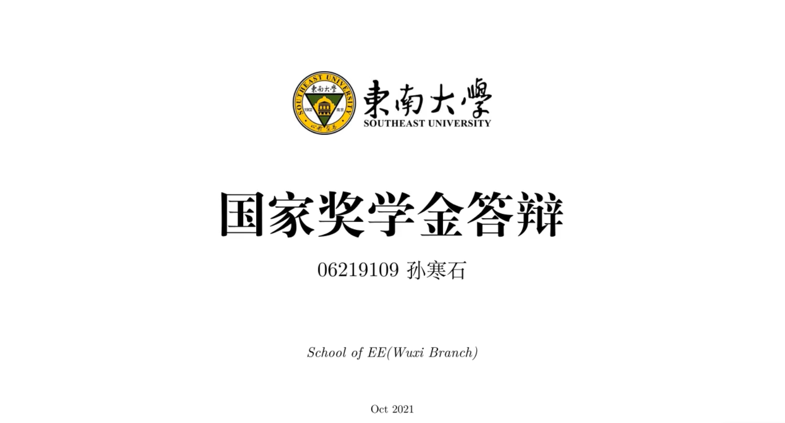
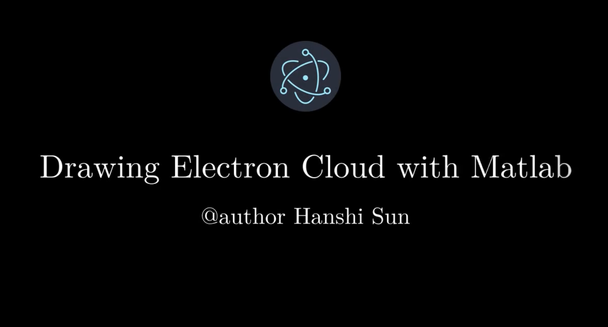

# Manim
##### @env Ubuntu 20.04, manim community v0.10.0 

Some projects that use *manim* engine. 

### Scholarship

The Project *Scholarship* is used for preparation for application for National Scholarship.

- Including 4 parts: Study, Research, Honors and Life.
- Time: Finished on *8 September 2021*
- The video is in `./Scholarship/media/videos/main/720p30/S1.mp4`
- The *1080p60* version or higher quality videos are too large to upload

### Draw Electron Cloud

This project is to draw Electron Cloud based on Matlab programming.

- Based on article "Drawing Angular Part of Atomic Orbital and Hybrid Orbital By Using MATLAB" by LV Shenzhuɑnɡ(School of Chemistry， Leshan Normal University， Leshan Sichuan 614000， China).

- The codes is not included in this repository.

